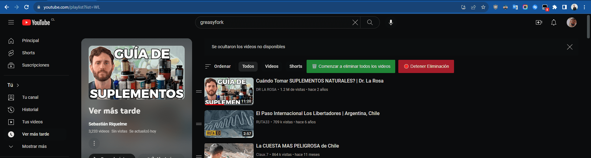

# Limpieza de Lista "Ver Más Tarde" de YouTube con Botones Animados

Elimina automáticamente los videos de la lista "Ver Más Tarde" de YouTube con botones animados.

## Características

-   Botón de inicio para eliminar automáticamente los videos.
-   Botón de detener para detener la eliminación.
-   Interfaz de usuario mejorada con animaciones.
-   Fácil de usar y personalizable.

## Instalación

1. Instala [Tampermonkey](https://www.tampermonkey.net/) en tu navegador.
2. [Haz clic aquí para instalar el script desde Greasy Fork](https://greasyfork.org/es/scripts/480797-limpieza-de-lista-ver-m%C3%A1s-tarde-de-youtube-con-botones-animados).

## Uso

1. Abre tu lista "Ver Más Tarde" en YouTube.
2. Haz clic en el botón de inicio para comenzar la eliminación automática.
3. Usa el botón de detener en cualquier momento para detener la eliminación.

## Contribuciones

¡Contribuciones y mejoras son bienvenidas! Si tienes ideas o cambios, abre un problema o envía una solicitud de extracción.

## Licencia

Este script está bajo la Licencia MIT.
